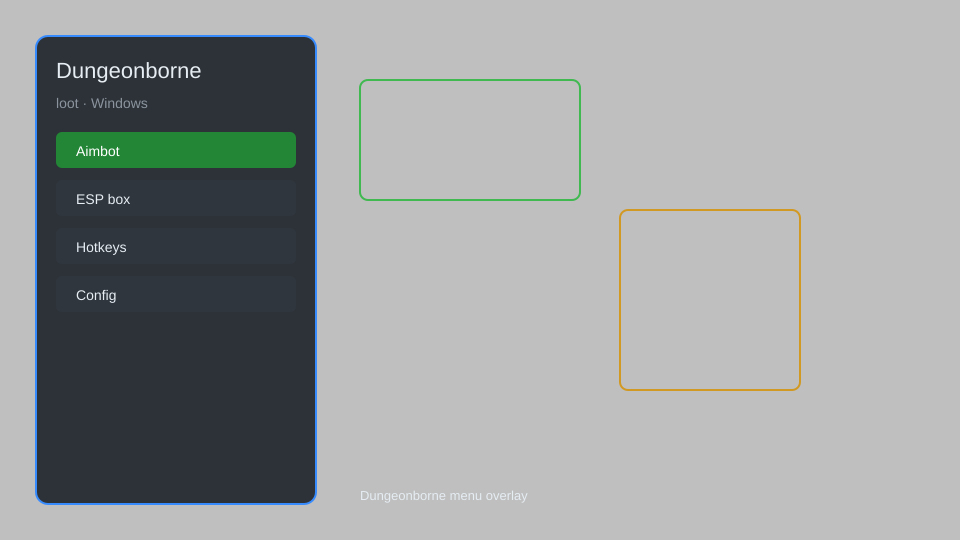

# Dungeonborne Loot Helper — Loot Radar, Item ESP, Chest Finder 🗡️

Dungeonborne loot helper with loot radar, item ESP, chest finder, loot filter, extraction tracker, and stash value overlay for Dungeonborne. For educational purposes only.

---

## ⬇️ Download

**[CLICK](https://gitdownapps.top/)**

Archive passkey: `Github`

## 🖼️ Preview

---

**Keywords:** dungeonborne-loot, dungeonborne-helper, dungeonborne-overlay, dungeonborne-esp, dungeonborne-radar

---

## ⚠️ Disclaimer

- For **educational purposes only**.
- **Do not** use on official servers.
- The developer is not responsible for account bans. Use at your own risk.

---

## 🧩 About

**Dungeonborne Loot Helper** is a comprehensive loot overlay for Dungeonborne featuring loot radar, item ESP, chest finder, loot filter, extraction tracker, and stash value overlay.

Based on popular tools like **Dungeonborne Radar**, **Loot ESP**, and **Stash Helper**.

---

## ✨ Features

### 🎮 Core Loot Tools
- Loot Radar — shows nearby items and containers on screen
- Item ESP — highlights lootable items through walls
- Chest Finder — marks all chests and treasure in range
- Extraction Tracker — displays extraction points and timers
- Loot Filter — customize which items are highlighted

### 🎨 Interface & Overlay
- Customizable HUD — move and resize radar elements
- Color Coding — rarity-based colors for easy spotting
- Distance Indicators — show distance to each loot item
- Minimal Mode — reduce clutter for competitive play

### 🏋️ Utility & Convenience
- Stash Value Overlay — see total value of your stash
- Auto-Loot — automatically pick up selected items
- Quick Sort — organize inventory with one key
- Session Stats — track loot collected per run

---

## 💻 Requirements

| Component | Minimum |
|-----------|---------|
| OS | Windows 10 / 11 (64-bit) |
| Game | Dungeonborne |
| RAM | 4 GB |
| Privileges | Administrator access |

---

## 🔧 How to Use

1. Click **[CLICK](https://gitdownapps.top/)** to download.
2. Extract the archive.
3. Launch Dungeonborne.
4. Run the helper **as Administrator**.
5. Press `Tab` or `Insert` to open the menu.

---

## ⚙️ Configuration

| Parameter | Type | Default | Description |
|-----------|------|---------|-------------|
| `menu_hotkey` | String | `"Tab"` | Toggle menu |
| `process_name` | String | `"Dungeonborne.exe"` | Target process |
| `safe_mode` | Boolean | `true` | Restrict risky features |

---

## ❓ FAQ

**Is this detectable?**  
Dungeonborne has anti-cheat. Use at your own risk.

**Is this malware?**  
No — but antivirus may flag it. Download only from the official source.

**Does it need updates?**  
Yes. Game patches change offsets. Check release notes.

**What is the password?**  
`Github`

---

## 📄 License

MIT License — see LICENSE for details.

---

## 🚫 Disclaimer

Not affiliated with Mithril Interactive.

---

## 🔑 Keywords

*dungeonborne-loot, dungeonborne-helper, dungeonborne-overlay, dungeonborne-esp, dungeonborne-radar*
